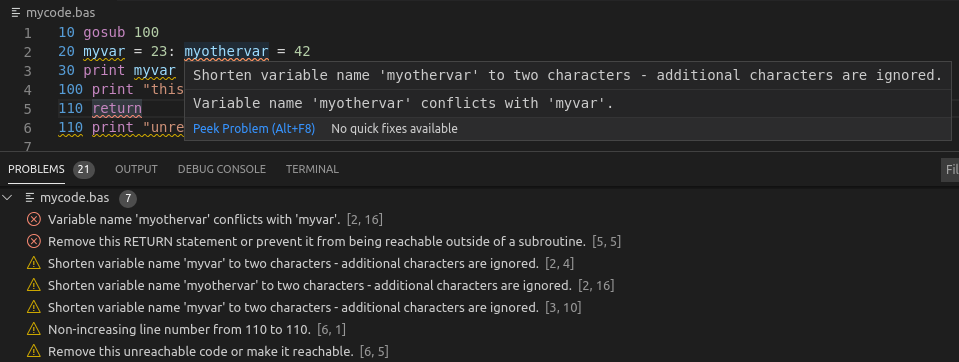

# Commodore BASIC V2 Support for Visual Studio Code

This is an extension providing syntax highlighting and error reporting / linting for Commodore BASIC V2 (the version of BASIC used in the C64).

## Features

* Syntax highlighting
* Error reporting and linting using the [sabas64 static analyzer](https://github.com/sepp2k/sabas64)

## Requirements

This extension requires a Java Runtime Environment for Java 8 or later.

## Known Issues

Versions of BASIC besides Commodore BASIC v2 are not supported. Neither are custom syntax extensions.

## License

Copyright 2020 Sebastian Hungerecker.

Licensed under the [GNU Lesser General Public License, Version 3.0](LICENSE) or later